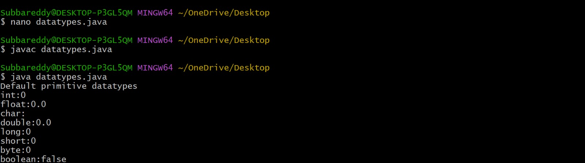
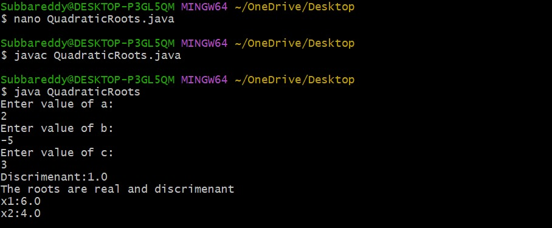
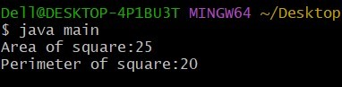
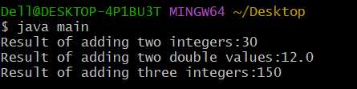
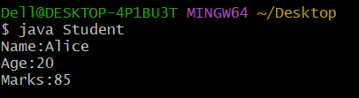

# JAVALAB

# Expt-1a
```java
class Test {
    byte b;
    int i;
    float f;
    char c;
    double d;
    long l;
    short s;
    boolean bl;

    public static void main(String[] args) {
        Test t = new Test();
        System.out.println(t.b);
        System.out.println(t.i);
        System.out.println(t.f);
        System.out.println(t.c);
        System.out.println(t.d);
        System.out.println(t.l);
        System.out.println(t.s);
        System.out.println(t.bl);
        
    }
}

```
#output:


# Expt-1b
```java
import java.util.Scanner;

class QuadraticRoots {
    public static void main(String[] args) {

        double a, b, c, D;
        Scanner sc = new Scanner(System.in);

        System.out.print("Enter value of a: ");
        a = sc.nextDouble();

        System.out.print("Enter value of b: ");
        b = sc.nextDouble();

        System.out.print("Enter value of c: ");
        c = sc.nextDouble();

        D = b * b - 4 * a * c;
        System.out.println("Discriminant (D) = " + D);

        if (D > 0) {
            double x1 = (-b + Math.sqrt(D)) / (2 * a);
            double x2 = (-b - Math.sqrt(D)) / (2 * a);

            System.out.println("Roots are real and distinct.");
            System.out.println("Root 1 = " + x1);
            System.out.println("Root 2 = " + x2);

        } else if (D == 0) {
            double x = -b / (2 * a);
            System.out.println("Roots are real and equal.");
            System.out.println("Root = " + x);

        } else {
            double real = -b / (2 * a);
            double imaginary = Math.sqrt(-D) / (2 * a);

            System.out.println("Roots are imaginary (complex).");
            System.out.println("Root 1 = " + real + " + i" + imaginary);
            System.out.println("Root 2 = " + real + " - i" + imaginary);
        }

        sc.close();
    }
}
```
#output:


# Expt-2a
```java
class square{
int length;
int areaofsquare(){
return length*length;
}
int perimeterofsqaure(){
retrun 4*length;
}
}
class main{
public static void main(String args[]){
square sq=new square();
sq.length=5;
int area=sq.areaofsquare();
int perimeter=perimeterofsquare();
System.out.println("Area of Square:"+area);
System.out.println("Perimeter of Square:"+perimeter);
}
}
```
#output:



# Expt-2b
```java
class Add{
int add(int a,int b){
return a+b;
}
double add(double a,double b){
return a+b;
}
int add(int a,int b,int c){
return a+b+c;
}
}
class main{
public static void main(String args[]){
Add obj=new Add();
System.out.println("Result of adding two integers:"+obj.add(10,20));
System.out.println("Result of adding two double values:"+obj.add(5.5,6.5));
System.out.println("Result of adding three integers:"+obj.add(40,50,60));
}
}
```
#output:


# Expt-2c
```java
class Student{
String name;
int age;
int marks;
Student(String n,int a,int b){
name=n;
age=a;
marks=m;
}
void display(){
System.out.println("Name:"+name);
System.out.println(Age:"+age);
System.out.println("Marks:"+marks);
}
public static void main(String args[]){
Student s1=new Student("Alice",20,85);
s1.display();
}
}
```
# output:

